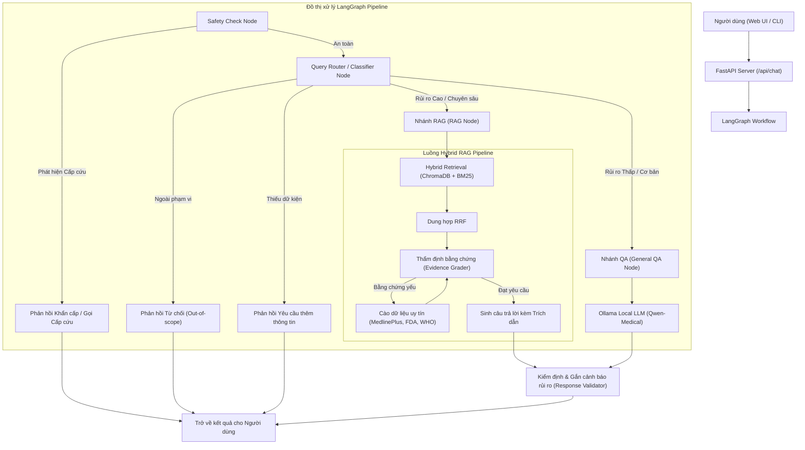

# 🏥 Hệ thống Trợ lý Y tế Thông minh (Intelligent Medical Assistant RAG)

[](https://www.python.org/)
[](https://fastapi.tiangolo.com/)
[](https://react.dev/)
[](https://langchain-ai.github.io/langgraph/)
[](https://ollama.ai/)

Hệ thống Trợ lý Y tế Thông minh hỗ trợ tư vấn sức khỏe bằng tiếng Việt, được xây dựng trên kiến trúc **Full-stack hiện đại (React + FastAPI)** kết hợp mô hình điều phối luồng **LangGraph Workflow** và tìm kiếm tăng cường độ chính xác cao (**Hybrid RAG**).

> [!IMPORTANT]
> **Tuyên bố Miễn trừ Trách nhiệm Y tế (Medical Disclaimer):**
> Đây là nguyên mẫu nghiên cứu & giáo dục hỗ trợ tư vấn y tế. Hệ thống **KHÔNG** thay thế chẩn đoán, đơn thuốc hay lời khuyên điều trị từ bác sĩ chuyên khoa. Đối với các triệu chứng cấp cứu hoặc chuyển biến nặng, người dùng phải lập tức liên hệ cơ sở y tế gần nhất hoặc gọi tổng đài cấp cứu (115).

---

## 🌟 Điểm nhấn & Định hướng Công nghệ (Current Direction)

Dự án được phát triển theo hướng đi chuẩn xác và hiện đại nhất cho các hệ thống tư vấn y khoa tự trị (Agentic Medical AI):

1. **Kiến trúc Full-stack Độc lập & Hiện đại:**
   - **Backend API:** Sử dụng **FastAPI** hiệu năng cao, hỗ trợ truy vấn RESTful API (`/api/chat`), truyền phát dữ liệu thời gian thực qua Server-Sent Events (SSE Streaming `/api/chat/stream`) và cung cấp thống kê hệ thống.
   - **Frontend UI:** Giao diện người dùng web động, tối ưu trải nghiệm (UX/UI) được xây dựng bằng **React + Vite**, dễ dàng tùy biến và triển khai trên mọi thiết bị.

2. **Đuờng ống Điều phối Thông minh với LangGraph (`LangGraphPipeline`):**
   - Không sử dụng luồng hỏi đáp tuyến tính cứng nhắc. Câu hỏi được luân chuyển qua đồ thị trạng thái (`StateGraph`) với các nút (Node) chuyên biệt.
   - **Node Kiểm duyệt An toàn (Safety Guard):** Nhận diện các từ khóa/tình huống khẩn cấp (nhồi máu cơ tim, đột quỵ, tự tử, ngộ độc...) ngay tại cửa ngõ để phát ra phản hồi khẩn cấp lập tức mà không tốn thời gian suy luận LLM.
   - **Node Phân loại & Định tuyến (Query Router):** Phân loại danh mục y khoa (`drug_safety`, `interactions`, `pregnancy`, `overdose`...) và đánh giá mức độ rủi ro (`low`, `medium`, `high`, `critical`) để định tuyến xử lý tối ưu sang 2 luồng riêng biệt:
     - *Nhánh RAG (`rag_node`):* Kích hoạt cho các câu hỏi y khoa chuyên sâu hoặc có rủi ro cao/nghiêm trọng (tác dụng phụ, liều dùng, thai kỳ...). Hệ thống tìm kiếm bằng chứng từ ChromaDB & BM25 trước khi LLM tổng hợp câu trả lời kèm trích dẫn.
     - *Nhánh General QA (`general_qa_node`):* Kích hoạt cho các câu chào hỏi giao tiếp cơ bản hoặc câu hỏi sức khỏe chung chung có rủi ro thấp/trung bình. Câu hỏi được bỏ qua bước tìm kiếm RAG để gửi thẳng tới mô hình LLM cục bộ (`QwenMedicalLLM`) trả lời siêu tốc.

3. **Tìm kiếm Lai Tối ưu (Hybrid Retrieval + RRF):**
   - Kết hợp tìm kiếm ngữ nghĩa sâu (Semantic Vector Search qua **ChromaDB**) và tìm kiếm từ khóa chính xác (Lexical Search qua **BM25**).
   - Thuật toán **Reciprocal Rank Fusion (RRF)** dung hợp kết quả từ hai bộ máy, loại bỏ nhiễu và đưa ra bằng chứng liên quan nhất.

4. **Thẩm định Bằng chứng & Tự động Bổ sung Kiến thức (Evidence Grader & Web Crawler):**
   - Bằng chứng truy xuất được tự động chấm điểm độ tin cậy. Nếu dữ liệu nội bộ không đủ độ tin cậy, hệ thống kích hoạt **Crawler chuyên dụng** tìm kiếm bổ sung từ các nguồn y khoa uy tín hàng đầu thế giới (`medlineplus.gov`, `dailymed.nlm.nih.gov`, `fda.gov`, `who.int`).

5. **Tối ưu hóa AI Cục bộ (Local LLM với Ollama):**
   - Hỗ trợ chạy các mô hình tinh chỉnh y tế cục bộ (như `Qwen3-4B-Medical` qua **Ollama** hoặc các mô hình GGUF) giúp bảo mật tuyệt đối thông tin nhạy cảm của người bệnh, tốc độ phản hồi siêu tốc và khả năng hoạt động offline.

---

## 🏗️ Kiến trúc Hệ thống (System Architecture)

Sơ đồ dưới đây mô tả luồng xử lý thực tế của hệ thống từ khi tiếp nhận câu hỏi đến khi trả lời:



---

## 📂 Cấu trúc Thư mục Dự án

```text
.
├── backend/                       # Backend API Server & Xử lý RAG lõi
│   ├── api.py                     # Máy chủ FastAPI (REST API & SSE Streaming)
│   ├── main.py                    # Giao diện CLI hỗ trợ kiểm thử & Ingest dữ liệu
│   ├── config.py                  # Cấu hình tham số trung tâm
│   ├── requirements.txt           # Danh sách thư viện Python
│   ├── data/                      # Dữ liệu y khoa (raw, processed, categories.json)
│   ├── evaluation/                # Bộ kiểm thử & đánh giá tự động (RAGAs / Custom)
│   └── src/                       # Các module xử lý nghiệp vụ lõi
│       ├── langgraph_pipeline.py  # Điều phối workflow bằng LangGraph
│       ├── rag_pipeline.py        # Luồng xử lý RAG truyền thống
│       ├── hybrid_retriever.py    # Kết hợp Vector Store + BM25 + RRF
│       ├── qwen_llm.py            # Giao tiếp với Ollama Local LLM
│       ├── safety_guard.py        # Bảo vệ, phát hiện cấp cứu & từ chối
│       ├── evidence_grader.py     # Chấm điểm độ tin cậy bằng chứng
│       ├── web_crawler.py         # Tìm kiếm fallback từ nguồn uy tín
│       └── ...
├── frontend/                      # Giao diện Web App
│   ├── src/                       # Mã nguồn React UI (Components, Hooks)
│   ├── package.json               # Cấu hình & thư viện NodeJS
│   └── vite.config.js             # Cấu hình Vite bundler
├── notebooks/                     # Nghiên cứu, thực nghiệm & fine-tuning
│   ├── 01-train-qwen3-medical-qa.ipynb # Huấn luyện LLM y tế
│   └── 03_clean_rag_chunks_vi.ipynb    # Làm sạch dữ liệu RAG tiếng Việt
├── models/                        # Thư mục lưu trữ cơ sở dữ liệu Vector & trọng số
├── Modelfile                      # Định nghĩa cấu hình Ollama cho model Qwen Medical
└── README.md                      # Tài liệu hướng dẫn hệ thống
```

---

## 🚀 Hướng dẫn Cài đặt & Khởi chạy

Các lệnh dưới đây được hướng dẫn trên môi trường **Windows PowerShell**.

### 1. Chuẩn bị Môi trường Backend

Tạo môi trường ảo, kích hoạt và cài đặt các thư viện cần thiết:

```powershell
# Di chuyển vào thư mục dự án
cd path\to\Intelligent-Medical-Assistant-for-Healthcare-Consultation

# Tạo và kích hoạt virtual environment
python -m venv .venv
.\.venv\Scripts\Activate.ps1

# Cài đặt các gói phụ thuộc cho Backend
pip install --upgrade pip
pip install -r backend/requirements.txt
```

> [!NOTE]
> Nếu PowerShell chặn lệnh kích hoạt do chính sách bảo mật, hãy chạy lệnh sau trước:
> `Set-ExecutionPolicy -Scope Process -ExecutionPolicy Bypass`

Cấu hình biến môi trường bằng cách tạo file `backend/.env` (hoặc sao chép từ `backend/.env.example`):
```env
# Optional: Thiết lập token HuggingFace để tránh giới hạn tải model embedding
HF_TOKEN=your_huggingface_token_here

# Đặt true nếu muốn chạy chế độ test nhanh bằng hash embedding thay vì tải model thật
FORCE_FALLBACK_EMBEDDINGS=false
```

### 2. Chuẩn bị Mô hình Local AI (Ollama)

Hệ thống hoạt động 100% cục bộ (Local AI), không phụ thuộc vào API bên thứ ba để đảm bảo quyền riêng tư dữ liệu y tế. Bạn cần chuẩn bị Ollama:
1. Cài đặt [Ollama](https://ollama.ai/).
2. Tạo model y tế từ `Modelfile` có sẵn trong dự án:
   ```powershell
   ollama create qwen_medical -f Modelfile
   ```

### 3. Chuẩn bị Cơ sở Dữ liệu Kiến thức (Data Ingestion)

Trước khi hỏi đáp, cần nạp dữ liệu y khoa, tạo embedding vector (ChromaDB) và chỉ mục từ khóa (BM25):

```powershell
cd backend
python main.py --ingest
```

*Kết quả mong đợi:* Hệ thống làm sạch dữ liệu từ `data/raw`, tạo chunk tiếng Việt và lưu trữ vào `data/processed` cùng `models/chromadb`.

### 4. Khởi chạy Hệ thống Full-stack

Bạn cần mở 2 cửa sổ terminal riêng biệt cho Backend và Frontend.

#### 🌐 Terminal 1: Khởi chạy Backend API (FastAPI)
```powershell
.\.venv\Scripts\Activate.ps1
cd backend
python api.py
```
*Backend API Server sẽ lắng nghe tại:* `http://localhost:8000` (Tài liệu Swagger UI tại `http://localhost:8000/docs`).

#### 🖥️ Terminal 2: Khởi chạy Frontend Web UI (React + Vite)
```powershell
cd frontend
npm install
npm run dev
```
*Giao diện Web App sẽ chạy tại:* `http://localhost:5173`. Open trình duyệt và bắt đầu trải nghiệm tư vấn sức khỏe!

---

## 💻 Trải nghiệm qua Giao diện CLI (Đóng gói tiện lợi)

Bên cạnh Web UI, bạn có thể kiểm thử trực tiếp luồng RAG hoặc LangGraph qua giao diện dòng lệnh (CLI):

```powershell
cd backend

# Hỏi một câu hỏi đơn lẻ
python main.py --query "Tác dụng phụ của thuốc warfarin là gì?"

# Hiển thị cấu trúc JSON chi tiết (bao gồm độ tin cậy, danh mục, nguồn trích dẫn)
python main.py --query "Tôi có thể uống ibuprofen cùng với warfarin không?" --json

# Chế độ hỏi đáp tương tác liên tục (Interactive Mode)
python main.py
```

---

## 🧪 Đánh giá & Kiểm thử Chất lượng (Evaluation & Testing)

Dự án tích hợp sẵn bộ kiểm thử tự động để đảm bảo tính an toàn y khoa tuyệt đối.

### Kiểm thử tự động (Unit / Integration Tests)
Chạy kiểm thử các vi kịch bản: nhận diện cấp cứu, từ chối câu hỏi ngoài phạm vi, và độ chính xác phân loại:

```powershell
cd backend
python -m pytest evaluation/ -q
```

### Chạy bộ Đánh giá Chuẩn (Evaluation Pipeline)
Đánh giá các chỉ số cốt lõi (Emergency Detection Rate, Out-of-scope Refusal, Citation Accuracy, Disclaimer Presence):

```powershell
cd backend
python evaluation/evaluate.py
```

---

## 🛡️ Tiêu chuẩn An toàn Y khoa (Safety Protocols)

Hệ thống tuân thủ nghiêm ngặt 4 nguyên tắc bảo vệ:
1. **Ưu tiên Cấp cứu (Emergency Triage):** Nhận diện tức thì các từ khóa nguy hiểm đến tính mạng (đau ngực dữ dội, khó thở, ngộ độc, ý định tự sát...) để đưa ra chỉ dẫn gọi 115 lập tức.
2. **Phạm vi Y khoa (Scope Restriction):** Chỉ trả lời các câu hỏi liên quan đến bệnh lý, thông tin thuốc, tương tác thuốc, chăm sóc sức khỏe thai kỳ/nhi khoa/người già. Từ chối câu hỏi lập trình, thời tiết, giải trí...
3. **Trích dẫn Minh bạch (Mandatory Citation):** Mọi câu trả lời thuộc nhóm rủi ro cao buộc phải dựa trên bằng chứng RAG và ghi rõ nguồn tham khảo.
4. **Cảnh báo Rủi ro Phân cấp (Risk-based Disclaimers):** Tự động đính kèm khuyến cáo dựa trên mức độ rủi ro (Ví dụ: câu hỏi về thai kỳ và nhi khoa luôn có cảnh báo rủi ro cao/nghiêm trọng).

---

## 💡 Hướng dẫn Xử lý Sự cố (Troubleshooting)

- **Lỗi `Collection expecting embedding with dimension...`:** Xảy ra khi chuyển đổi mô hình embedding (giữa fallback hash và mô hình thật). Khắc phục bằng cách nạp lại dữ liệu: `cd backend && python main.py --ingest`.
- **Lỗi không kết nối được Ollama:** Đảm bảo dịch vụ Ollama đang chạy ngầm trên máy (`http://localhost:11434`) và đã tải model `qwen_medical`. Nếu LLM gặp lỗi, pipeline RAG được thiết kế để tự động kích hoạt cơ chế rút trích thông tin trực tiếp (extractive fallback) từ tài liệu RAG nhằm đảm bảo phản hồi không bị gián đoạn.
