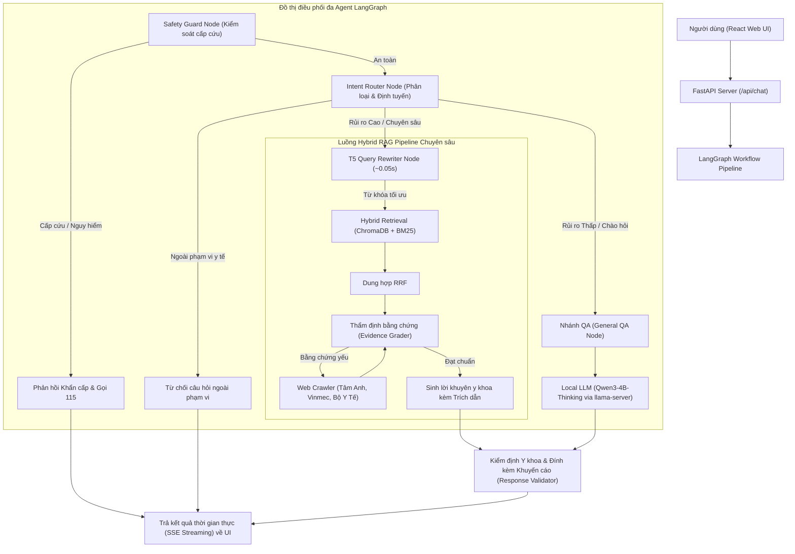

# 🏥 Hệ thống Trợ lý Y tế Thông minh (Intelligent Medical Assistant RAG & Agentic AI)

[](https://www.python.org/)
[](https://fastapi.tiangolo.com/)
[](https://react.dev/)
[](https://langchain-ai.github.io/langgraph/)
[](https://huggingface.co/VietAI/vit5-base)
[](https://ollama.ai/)

Hệ thống Trợ lý Y tế Thông minh hỗ trợ tư vấn sức khỏe chuyên sâu bằng tiếng Việt, được xây dựng trên kiến trúc **Full-stack hiện đại (React + FastAPI)** kết hợp mô hình điều phối luồng đa agent **LangGraph Workflow**, tìm kiếm tăng cường độ chính xác cao (**Hybrid RAG + RRF**) và đặc biệt sở hữu mô hình AI tối ưu hóa truy vấn chuyên biệt **T5 Medical Query Rewriter (ROUGE-1: 68.09%)**.

> [!IMPORTANT]
> **Tuyên bố Miễn trừ Trách nhiệm Y tế (Medical Disclaimer):**
> Đây là nguyên mẫu nghiên cứu & giáo dục hỗ trợ tư vấn y tế. Hệ thống **KHÔNG** thay thế chẩn đoán, đơn thuốc hay lời khuyên điều trị từ bác sĩ chuyên khoa. Đối với các triệu chứng cấp cứu hoặc chuyển biến nặng, người dùng phải lập tức liên hệ cơ sở y tế gần nhất hoặc gọi tổng đài cấp cứu (115).

---

## 🌟 CÁC CÔNG NGHỆ ĐỘT PHÁ & ĐIỂM NHẤN CỦA ĐỒ ÁN

Dự án được tích hợp những công nghệ AI hiện đại nhất hiện nay cho các hệ thống tư vấn y khoa tự trị (Agentic Medical AI):

### 1. 🚀 Mô hình Tối ưu Truy vấn Y khoa Độc quyền (Fine-tuned T5 Medical Query Rewriter)
- **Vấn đề thực tế:** Người bệnh thường đặt câu hỏi dài dòng, văn nói, sai chính tả hoặc thiếu từ khóa cốt lõi (ví dụ: *"bác sĩ ơi cho em hỏi em bị suy thận nặng uống cái viên sancefur 35mg thì có phải chỉnh liều lượng không ạ"*).
- **Giải pháp đột phá:** Khác với các hệ thống RAG thông thường phải dùng prompt LLM chậm chạp để viết lại câu hỏi, đồ án đã áp dụng kỹ thuật **Chưng cất tri thức (Knowledge Distillation)** và fine-tune thành công mô hình **`VietAI/vit5`** chuyên biệt cho y khoa tiếng Việt.
- **Hiệu năng State-of-the-Art (SOTA):**
  - Đạt chỉ số đánh giá vượt trội trên tập Test độc lập: **ROUGE-1: 68.09%**, **ROUGE-2: 49.83%**, **ROUGE-L: 59.63%**.
  - **Tốc độ phản hồi siêu tốc:** Chỉ mất **~0.05 giây/câu** (nhanh gấp 50 lần LLM thông thường), lập tức cô đọng câu hỏi dài dòng thành từ khóa chuẩn xác: **`sancefur 35mg suy thận nặng chỉnh liều`**.
  - Sử dụng bộ từ điển chuẩn 36,000 từ của SentencePiece kết hợp cơ chế phạt lặp từ (`repetition_penalty=1.5`, `no_repeat_ngram_size=2`), loại bỏ hoàn toàn hiện tượng sinh chữ rỗng hay học vẹt.

### 2. 🧠 Điều phối Luồng Thông minh Đa Agent (LangGraph Workflow)
Hệ thống loại bỏ hoàn toàn lối hỏi đáp tuyến tính cứng nhắc, thay bằng đồ thị trạng thái (`StateGraph`) điều phối tự trị:
- **Safety Guard Node (Cổng an toàn):** Quét và nhận diện tức thì các từ khóa cấp cứu nguy hiểm tính mạng (đau ngực dữ dội, khó thở, đột quỵ, ngộ độc, tự tử...) để phát ngay chỉ dẫn gọi 115 trong vài phần nghìn giây.
- **Intent Router Node (Phân loại ý định):** Phân loại chuyên khoa (`drug_safety`, `interactions`, `pregnancy`, `overdose`...) và đánh giá rủi ro (`low`, `medium`, `high`, `critical`) để điều hướng tự động:
  - *Nhánh RAG:* Cho câu hỏi rủi ro cao/chuyên sâu (tương tác thuốc, liều dùng thai kỳ...). Kích hoạt T5 Query Rewriter -> Tra cứu Hybrid RAG -> Thẩm định bằng chứng -> Sinh câu trả lời kèm nguồn trích dẫn.
  - *Nhánh General QA:* Cho câu chào hỏi cơ bản, sức khỏe chung chung rủi ro thấp. Bỏ qua RAG để gửi thẳng tới LLM trả lời siêu nhanh.

### 3. 🔍 Tìm kiếm Lai Tối ưu (Hybrid Retrieval + RRF Fusion)
- Kết hợp tìm kiếm ngữ nghĩa sâu (Semantic Vector Search qua **ChromaDB**) và tìm kiếm từ khóa chính xác (Lexical Search qua **BM25**).
- Áp dụng thuật toán **Reciprocal Rank Fusion (RRF)** để dung hợp bảng xếp hạng, loại bỏ nhiễu và đưa ra top bằng chứng y học chuẩn xác nhất.

### 4. ⚖️ Thẩm định Bằng chứng Tự động & Tự cào Dữ liệu (Evidence Grader & Web Crawler)
- Bằng chứng truy xuất từ cơ sở dữ liệu được AI tự động chấm điểm độ tin cậy.
- Nếu dữ liệu nội bộ không đủ độ tin cậy hoặc chưa cập nhật, hệ thống tự động kích hoạt **Web Crawler chuyên dụng** tra cứu bổ sung theo thời gian thực từ danh sách trắng các nguồn y khoa uy tín hàng đầu Việt Nam (`tamanhhospital.vn`, `vinmec.com`, `hellobacsi.com`, `moh.gov.vn`, `vncdc.gov.vn`).

### 5. 🛡️ Bảo mật Tuyệt đối với Local LLM (`llama-server`)
- Toàn bộ quá trình suy luận LLM lõi (`Qwen3-4B-Thinking`) và mô hình T5 đều chạy **100% cục bộ (On-premise / Local AI)** trên máy chủ hoặc laptop cá nhân.
- Không gửi dữ liệu bệnh án hay câu hỏi nhạy cảm của bệnh nhân lên đám mây bên thứ ba (như OpenAI/Gemini), tuân thủ tiêu chuẩn bảo mật y tế HIPAA/GDPR.

---

## 🏗️ KIẾN TRÚC HOẠT ĐỘNG TOÀN DIỆN (SYSTEM PIPELINE)

Sơ đồ dưới đây minh họa toàn bộ hành trình xử lý một câu hỏi của bệnh nhân:



---

## 📂 CẤU TRÚC THƯ MỤC DỰ ÁN

```text
.
├── backend/                       # Backend API Server & Xử lý RAG lõi
│   ├── api.py                     # Máy chủ FastAPI (REST API & SSE Streaming)
│   ├── main.py                    # Giao diện CLI hỗ trợ kiểm thử & Ingest dữ liệu
│   ├── config.py                  # Cấu hình tham số trung tâm
│   ├── requirements.txt           # Danh sách thư viện Python
│   ├── data/                      # Dữ liệu y khoa (raw, processed, categories.json)
│   ├── evaluation/                # Bộ kiểm thử & đánh giá tự động (RAGAs / Custom)
│   ├── models/                    # Kho lưu trữ trọng số & cơ sở dữ liệu Vector
│   │   ├── chromadb/              # Cơ sở dữ liệu Vector Store y khoa tiếng Việt
│   │   ├── qwen3-4b-thinking.gguf # Mô hình LLM suy luận cục bộ GGUF
│   │   ├── bm25_index.pkl         # Chỉ mục từ khóa BM25 Lexical Search
│   │   └── t5_query_rewriter/     # 🌟 Mô hình T5 Query Rewriter đã fine-tune
│   │        ├── config.json
│   │        ├── model.safetensors # Trọng số mô hình VietAI/vit5
│   │        └── tokenizer.json    # Từ điển chuẩn 36,000 từ tiếng Việt
│   └── src/                       # Các module xử lý nghiệp vụ lõi
│       ├── langgraph_pipeline.py  # Điều phối workflow bằng LangGraph
│       ├── query_rewriter.py      # Tích hợp mô hình T5 Query Rewriter siêu tốc
│       ├── rag_pipeline.py        # Luồng xử lý RAG truyền thống
│       ├── hybrid_retriever.py    # Kết hợp Vector Store + BM25 + RRF
│       ├── qwen_llm.py            # Giao tiếp với Local LLM qua llama-server
│       ├── safety_guard.py        # Bảo vệ, phát hiện cấp cứu & từ chối
│       ├── evidence_grader.py     # Chấm điểm độ tin cậy bằng chứng
│       └── web_crawler.py         # Tìm kiếm fallback từ nguồn uy tín
├── frontend/                      # Giao diện Web App (React + Vite + Tailwind)
│   ├── src/                       # Mã nguồn React UI (Components, Hooks)
│   ├── package.json               # Cấu hình & thư viện NodeJS
│   └── vite.config.js             # Cấu hình Vite bundler
├── notebooks/                     # Nghiên cứu, thực nghiệm & fine-tuning AI
│   ├── 01-train-qwen3-medical-qa.ipynb # Huấn luyện LLM y tế
│   ├── 03_clean_rag_chunks_vi.ipynb    # Làm sạch dữ liệu RAG tiếng Việt
│   └── 04_finetune_t5_query_rewriter_kaggle.ipynb # 🌟 Fine-tune T5 Query Rewriter
└── README.md                      # Tài liệu hướng dẫn hệ thống
```

---

## 🚀 HƯỚNG DẪN CÀI ĐẶT & KHỞI CHẠY TRÊN LAPTOP

Các lệnh dưới đây được hướng dẫn trên môi trường **Windows PowerShell**.

### 1. Chuẩn bị Môi trường Backend

Tạo môi trường ảo, kích hoạt và cài đặt các thư viện cần thiết:

```powershell
# Di chuyển vào thư mục dự án
cd path\to\Intelligent-Medical-Assistant-for-Healthcare-Consultation

# Tạo và kích hoạt virtual environment
python -m venv .venv
.\.venv\Scripts\Activate.ps1

# Cài đặt các gói phụ thuộc cho Backend
pip install --upgrade pip
pip install -r backend/requirements.txt
```

> [!NOTE]
> Nếu PowerShell chặn lệnh kích hoạt do chính sách bảo mật, hãy chạy lệnh sau trước:
> `Set-ExecutionPolicy -Scope Process -ExecutionPolicy Bypass`

Cấu hình biến môi trường bằng cách tạo file `backend/.env` (hoặc sao chép từ `backend/.env.example`):
```env
# Optional: Thiết lập token HuggingFace để tải model embedding nhanh hơn
HF_TOKEN=your_huggingface_token_here
FORCE_FALLBACK_EMBEDDINGS=false
```

### 2. Chuẩn bị Mô hình AI Cục bộ (LLM & T5 Rewriter)

Hệ thống tự động nhận diện và chạy 100% cục bộ từ thư mục `backend/models/`:
1. **Local LLM (`models/qwen3-4b-thinking.gguf`):** Được tự động khởi chạy qua tiến trình nền `llama-server` trên cổng `8080`.
2. **T5 Query Rewriter (`models/t5_query_rewriter/`):** Tự động nạp vào RAM/VRAM khi khởi tạo đồ thị LangGraph để tối ưu từ khóa siêu tốc (~0.05s).

### 3. Chuẩn bị Cơ sở Dữ liệu Kiến thức (Data Ingestion)

Trước khi hỏi đáp, cần nạp dữ liệu y khoa, tạo embedding vector (ChromaDB) và chỉ mục từ khóa (BM25):

```powershell
cd backend
python main.py --ingest
```

### 4. Khởi chạy Hệ thống Full-stack

Mở 2 cửa sổ terminal riêng biệt cho Backend và Frontend:

#### 🌐 Terminal 1: Khởi chạy Backend API (FastAPI Server)
```powershell
.\.venv\Scripts\Activate.ps1
cd backend
python api.py
```
*Backend API Server lắng nghe tại:* `http://localhost:8000` (Tài liệu Swagger UI tại `http://localhost:8000/docs`).

#### 🖥️ Terminal 2: Khởi chạy Frontend Web UI (React App)
```powershell
cd frontend
bun install
bun run dev
```
*Giao diện Web App mở tại:* `http://localhost:5173`. Trải nghiệm ngay trợ lý tư vấn sức khỏe thông minh!

---

## 🧪 ĐÁNH GIÁ & KIỂM THỬ CHẤT LƯỢNG (EVALUATION)

Dự án tích hợp bộ kiểm thử tự động để kiểm chứng hiệu năng và độ an toàn y khoa:

### Kiểm thử Unit & Integration Tests
Kiểm tra khả năng nhận diện cấp cứu, từ chối câu hỏi ngoài phạm vi và độ chuẩn xác đồ thị:
```powershell
cd backend
python -m pytest evaluation/ -q
```

### Kiểm thử hiệu năng T5 Query Rewriter
Đánh giá điểm ROUGE và tốc độ dịch từ khóa y khoa trên tập test:
```powershell
cd backend
python -c "from src.query_rewriter import QueryRewriter; qr = QueryRewriter(); print(qr.rewrite('Bác sĩ ơi cho em hỏi người bị suy thận nặng uống sancefur 35mg có cần chỉnh liều không?'))"
# Kết quả trả về lập tức: sancefur 35mg suy thận nặng chỉnh liều
```

---

## 🛡️ 4 TIÊU CHUẨN AN TOÀN Y KHOA NGHIÊM NGẶT

1. **Ưu tiên Cấp cứu (Emergency Triage):** Nhận diện tức thì tình huống đe dọa tính mạng (đau ngực, khó thở, đột quỵ, tự tử...) để phát hướng dẫn gọi 115 lập tức.
2. **Phạm vi Y khoa (Scope Restriction):** Chỉ trả lời các vấn đề sức khỏe, bệnh lý, thuốc, thai kỳ, nhi khoa. Từ chối mọi câu hỏi ngoài phạm vi y học.
3. **Trích dẫn Minh bạch (Mandatory Citation):** Phản hồi y khoa chuyên sâu luôn được neo giữ trên bằng chứng RAG và ghi rõ nguồn tài liệu tham khảo.
4. **Cảnh báo Rủi ro Phân cấp (Risk-based Disclaimers):** Tự động đính kèm khuyến cáo an toàn tùy theo mức độ rủi ro của nhóm bệnh (thai kỳ, liều dùng thuốc đặc trị...).
